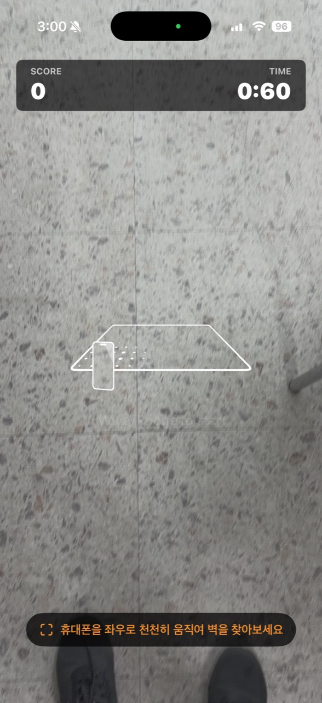
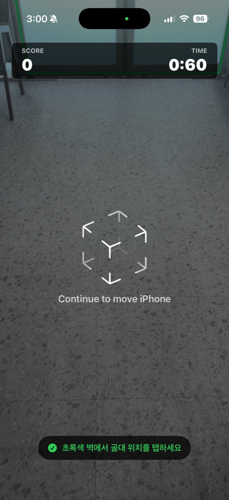
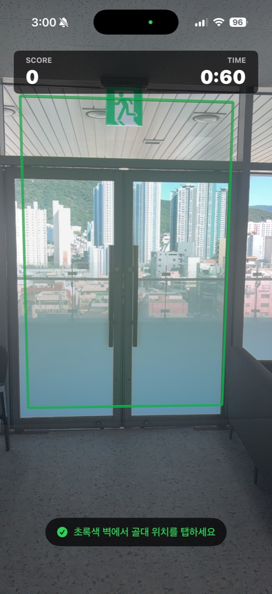
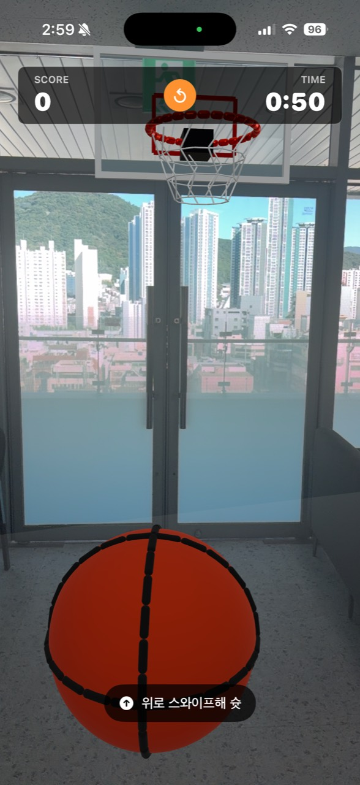

# AR Basket

[한국어](README.md) | **English**

AR Basket is an iOS augmented-reality basketball MVP built with SwiftUI, ARKit, and RealityKit.

## Gameplay

| Wall Scan | Placement Guide | Wall Detected | Gameplay |
| --- | --- | --- | --- |
|  |  |  |  |

## Features

- Vertical wall detection and wall-mounted hoop placement
- Detected-wall visualization and AR scanning guidance
- Swipe shooting based on gesture direction and speed
- Physics collisions for the ball, rim, and backboard
- Score detection when the ball passes through the rim
- Scoreboard and 60-second timer
- Restart flow for choosing a new hoop position
- Beginner-friendly aim assistance and scoring tolerance

## Requirements

- Xcode 16 or later
- iOS 17 or later
- A physical ARKit-compatible iPhone or iPad
- Camera permission

AR gameplay is not available in the simulator. The project can compile and run some tests there, but gameplay requires a physical ARKit-compatible device.

## Run

1. Open `ARBasket.xcodeproj` in Xcode.
2. Select the iPhone or iPad you want to use.
3. Choose your development team under Signing & Capabilities.
4. Build and run the app.
5. Point the camera at a wall and move the device slowly from side to side.
6. Tap a green detected wall or a vertical surface estimated by ARKit to place the hoop.
7. Swipe upward on the screen to shoot.

## Controls

- **Place hoop:** Tap a detected wall.
- **Shoot:** Swipe upward on the screen.
- **Restart:** Tap the small restart button in the top scoreboard, then tap a wall again.

## Technology

- Swift
- SwiftUI
- ARKit
- RealityKit
- XCTest

The project has no external dependencies.
